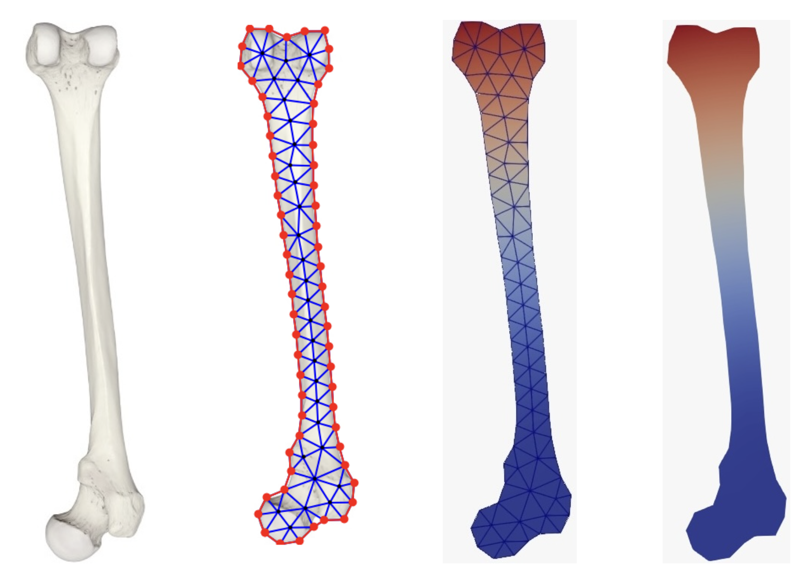

# Mesh Generation

This repository contains the implementation of A Mathematical Analysis of Image Mesh Generation Using Delaunay Triangulation and Image Processing Techniques. In this work, we explore the mathematical foundations and algorithms behind the generation of triangular meshes from image data, focusing on binary images with distinct regions, such as white zones.



## Instructions

	1.	Ensure the image is available in the same directory as the script or provide the correct file path in the code.
	2.	Modify the parameters (n_boundary_points, n_interior_points, min_distance, min_dist_to_boundary) according to the desired mesh density and structure:
	  •	n_boundary_points: Number of points along the boundary.
	  •	n_interior_points: Number of points inside the shape.
	  •	min_distance: Minimum spacing between interior points.
	  •	min_dist_to_boundary: Minimum distance from the boundary to interior points.
	3.	Run the script to generate and visualize the triangular mesh.

 ## Cite
 Considering citing our paper if you use this code in your work.
 ```bibtex
@inproceedings{rodrigues:hal-04822865,
  TITLE = {{A Mathematical Analysis of Image Mesh Generation Using Delaunay Triangulation and Image Processing Techniques}},
  AUTHOR = {Rodrigues, Jos{\'e} A and Vieira, Beatriz},
  URL = {https://hal.science/hal-04822865},
  BOOKTITLE = {{4th ROME International Conference on Challenges in Engineering, Medical, Economics and Education: Research \& Solutions (CEMEERS-24b)}},
  ADDRESS = {Rome, Italy},
  ORGANIZATION = {{International Forum of Engineers \& Practitioners}},
  YEAR = {2024},
  MONTH = Dec,
  KEYWORDS = {Delaunay Triangulation, Mesh Generation, Image Processing, Binary Image Segmentation, Grid Discretization, Computational Geometry},
  PDF = {https://hal.science/hal-04822865v1/file/beatriz_cemeers24b.pdf},
  HAL_ID = {hal-04822865},
  HAL_VERSION = {v1}
}
```

## References
Rodrigues, J. A., & Vieira, B. (2024).  
*A Mathematical Analysis of Image Mesh Generation Using Delaunay Triangulation and Image Processing Techniques*.  
4th ROME International Conference on Challenges in Engineering, Medical, Economics and Education: Research & Solutions (CEMEERS-24b).  
[PDF Available Here](https://hal.science/hal-04822865v1/file/beatriz_cemeers24b.pdf) | [HAL Archive](https://hal.science/hal-04822865)


